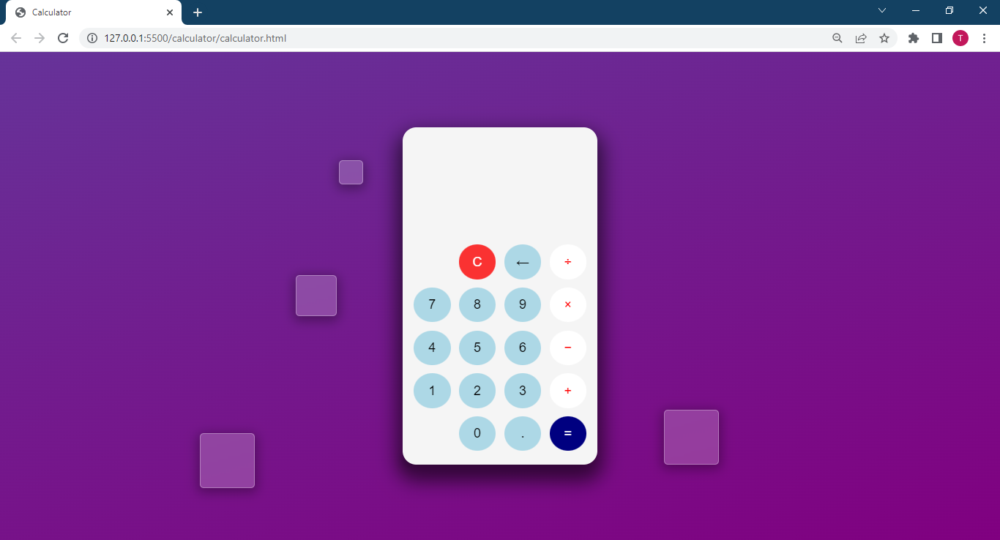

# Simple Calculator

This is a simple calculator that performs basic mathematical operations.

## Overview

Users can:

- perform basic mathematical operations
- backspace or clear the screen
- get a syntax error when an invalid expression is entered

## Screenshots

## Links

- [View Code](https://)
- [View Live Site](https://)

## Built with

- Semnatic HTML5 markup
- CSS Flexbox
- CSS Grid
- Mobile-first workflow

## What I Learned

- The `eval` function in JavaScript: evaluates a string as a mathematical expression and gives the result.
